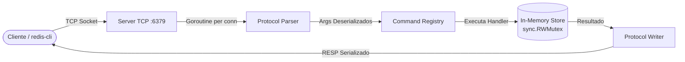

# redis-go ⚡

[](https://golang.org/)
[](LICENSE)
[](#)
[](#)

Uma implementação concorrente, modular e em memória de um servidor compatível com o protocolo **Redis (RESP - REdis Serialization Protocol)**, desenvolvida em **Go puro**, utilizando exclusivamente a biblioteca padrão (*standard library*).

---

## 📌 Índice

- [Sobre o Projeto](#-sobre-o-projeto)
- [Funcionalidades](#-funcionalidades)
- [Arquitetura](#-arquitetura)
- [Estrutura de Diretórios](#-estrutura-de-diretórios)
- [Comandos Suportados](#-comandos-suportados)
- [Pré-requisitos](#-pré-requisitos)
- [Como Executar](#-como-executar)
  - [Executando diretamente](#1-executando-diretamente)
  - [Compilando o binário](#2-compilando-o-binário)
- [Conectando ao Servidor](#-conectando-ao-servidor)
  - [Via `redis-cli`](#via-redis-cli)
  - [Via `nc` (Netcat) ou `telnet`](#via-nc-netcat-ou-telnet)
- [Exemplos Práticos](#-exemplos-práticos)
- [Roadmap & Próximos Passos](#-roadmap--próximos-passos)
- [Licença](#-licença)

---

## 📖 Sobre o Projeto

O **redis-go** foi projetado com foco em simplicidade, concorrência idiomática em Go e aderência às especificações do protocolo de rede do Redis. Cada cliente conectado é gerenciado por uma *goroutine* independente, comunicando-se com uma camada de armazenamento em memória sincronizada e protegida contra condições de corrida (*race conditions*).

### Destaques do Projeto:
- **Zero Dependências Externas**: Construído 100% com recursos nativos do Go (`net`, `bufio`, `sync`, `time`, etc.).
- **Concorrência Eficiente**: Modelo multithreaded leve via *goroutines* atendendo conexões TCP simultâneas.
- **Suporte a RESP e Comandos Inline**: Compatível tanto com clientes oficiais (que usam arrays RESP) quanto com clientes simples de texto puro via terminal.
- **Thread-Safety**: Armazenamento protegido com `sync.RWMutex`, viabilizando múltiplas leituras simultâneas e escritas exclusivas seguras.

---

## 🚀 Funcionalidades

- [x] Servidor TCP configurável (padrão `:6379`).
- [x] Parser completo de mensagens RESP (*Arrays*, *Bulk Strings*, validação de CRLF).
- [x] Parser de comandos *inline* com suporte a argumentos delimitados por aspas (`"..."`).
- [x] Formatador de respostas RESP (Simple String `+`, Error `-`, Integer `:`, Bulk String `$`, Null Bulk String `$-1`).
- [x] Expiração de chaves com TTL e verificação passiva no acesso.
- [x] Operações atômicas de incremento e decremento numérico (`INCR`, `DECR`).
- [x] Registro centralizado e extensível de comandos (*Command Registry pattern*).

---

## 🏗 Arquitetura

O fluxo de dados segue uma separação clara de responsabilidades entre transporte, protocolo, roteamento de comandos e armazenamento:



1. **`server`**: Gerencia o ciclo de vida do socket TCP e instancia uma goroutine por conexão ativa.
2. **`protocol`**: 
   - **Parser**: Lê streams de bytes do socket e decodifica requisições no formato RESP Array (`*<count>`) ou texto *inline*.
   - **Writer**: Serializa os tipos de retorno segundo a especificação RESP (`+OK`, `:1`, `$3\r\nfoo\r\n`, etc.).
3. **`command`**: Mapeia nomes de comandos (ex: `SET`, `GET`) para seus respectivos handlers e valida aridade/sintaxe.
4. **`storage`**: Estrutura `Store` com mapa em memória (`map[string]Value`), gerenciando dados e prazos de expiração (`ExpiresAt`) sob locks de leitura/escrita.

---

## 📂 Estrutura de Diretórios

```text
redis-go/
├── cmd/
│   └── main.go              # Ponto de entrada do programa (inicia o servidor em :6379)
├── internal/
│   ├── command/             # Registry e handlers de cada comando suportado
│   │   ├── command.go       # Estrutura do Registry e despachante (Execute)
│   │   ├── del.go           # Handler: DEL
│   │   ├── exists.go        # Handler: EXISTS
│   │   ├── expire.go        # Handler: EXPIRE
│   │   ├── get.go           # Handler: GET
│   │   ├── incr.go          # Handlers: INCR e DECR
│   │   ├── ping.go          # Handler: PING
│   │   ├── set.go           # Handler: SET (com suporte opcional a 'EX seconds')
│   │   └── ttl.go           # Handler: TTL
│   ├── protocol/            # Tratamento de protocolo RESP e parsing
│   │   ├── parser.go        # Leitor de comandos RESP e comandos inline
│   │   └── writer.go        # Escritor de respostas formatadas no padrão RESP
│   ├── server/              # Camada de rede e concorrência
│   │   └── server.go        # Listener TCP e rotina de gerenciamento de conexões
│   └── storage/             # Engine de armazenamento em memória
│       └── store.go         # Key-Value store thread-safe com sync.RWMutex e TTL
├── go.mod                   # Declaração do módulo Go
└── README.md                # Documentação do projeto
```

---

## 📋 Comandos Suportados

| Comando | Sintaxe | Descrição | Exemplo |
| :--- | :--- | :--- | :--- |
| **`PING`** | `PING [message]` | Testa conectividade com o servidor. Retorna `PONG` ou o argumento enviado. | `PING` → `+PONG` |
| **`SET`** | `SET key value [EX seconds]` | Grava uma chave e valor, opcionalmente definindo TTL em segundos. | `SET user "Alisson" EX 60` → `+OK` |
| **`GET`** | `GET key` | Obtém o valor de uma chave. Retorna `nil` se não existir ou se expirada. | `GET user` → `"Alisson"` |
| **`DEL`** | `DEL key [key ...]` | Remove uma ou múltiplas chaves. Retorna o número de chaves removidas. | `DEL key1 key2` → `(integer) 2` |
| **`EXISTS`** | `EXISTS key [key ...]` | Verifica a existência de uma ou mais chaves. Retorna o total encontrado. | `EXISTS user` → `(integer) 1` |
| **`INCR`** | `INCR key` | Incrementa o valor numérico da chave em 1 (cria com 1 se inexistente). | `INCR contador` → `(integer) 1` |
| **`DECR`** | `DECR key` | Decrementa o valor numérico da chave em 1 (cria com -1 se inexistente). | `DECR contador` → `(integer) 0` |
| **`EXPIRE`** | `EXPIRE key seconds` | Define um tempo de vida (TTL) em segundos para uma chave existente. | `EXPIRE sessao 30` → `(integer) 1` |
| **`TTL`** | `TTL key` | Retorna o tempo restante de vida da chave em segundos (`-1` sem TTL, `-2` não existe). | `TTL sessao` → `(integer) 29` |

---

## 🛠 Pré-requisitos

- [Go](https://go.dev/dl/) versão **1.22** ou superior instalada no sistema.
- Cliente para conexão: `redis-cli` (incluído no pacote Redis), `nc` (*netcat*) ou `telnet`.

---

## ⚙️ Como Executar

Clone o repositório em sua máquina:

```bash
git clone https://github.com/atwof/redis-go.git
cd redis-go
```

### 1. Executando diretamente

```bash
go run cmd/main.go
```

### 2. Compilando o binário

Para compilar um binário otimizado para sua plataforma:

```bash
go build -o bin/redis-go cmd/main.go
./bin/redis-go
```

O servidor inicializará emitindo o log:
```text
redis-go listening on :6379
```

---

## 🔌 Conectando ao Servidor

### Via `redis-cli`

Abra outro terminal e utilize a ferramenta oficial do Redis:

```bash
redis-cli -p 6379
```

### Via `nc` (Netcat) ou `telnet`

Graças ao parser *inline*, você pode interagir diretamente via texto plano:

```bash
nc localhost 6379
```
```text
PING
+PONG
SET curso "Golang"
+OK
GET curso
$6
Golang
```

---

## 🧪 Exemplos Práticos

Demonstração de uso interativo via `redis-cli`:

```bash
127.0.0.1:6379> PING "Hello World"
"Hello World"

127.0.0.1:6379> SET nome "redis-go"
OK

127.0.0.1:6379> GET nome
"redis-go"

127.0.0.1:6379> EXISTS nome
(integer) 1

127.0.0.1:6379> INCR visualizacoes
(integer) 1

127.0.0.1:6379> INCR visualizacoes
(integer) 2

127.0.0.1:6379> DECR visualizacoes
(integer) 1

127.0.0.1:6379> SET token "abc123xyz" EX 10
OK

127.0.0.1:6379> TTL token
(integer) 8

127.0.0.1:6379> DEL nome visualizacoes
(integer) 2
```

---

## 🗺 Roadmap & Próximos Passos

Evoluções planejadas e sugestões de contribuição para o projeto:

- [ ] **Expiração Ativa (Active Eviction)**: Implementar uma rotina em background (*ticker worker*) que amostra periodicamente chaves expiradas para liberar memória proativamente.
- [ ] **Políticas de Despejo de Memória (Eviction Policies)**: Algoritmos como LRU (*Least Recently Used*) e LFU (*Least Frequently Used*) ao atingir limites de memória (`maxmemory`).
- [ ] **Novas Estruturas de Dados**:
  - Listas (`LPUSH`, `RPUSH`, `LPOP`, `RPOP`, `LRANGE`)
  - Hashes (`HSET`, `HGET`, `HGETALL`, `HDEL`)
  - Sets (`SADD`, `SMEMBERS`, `SREM`)
- [ ] **Persistência em Disco**:
  - RDB (*Snapshotting* em intervalos)
  - AOF (*Append Only File* para recuperação após crash)
- [ ] **Pub/Sub**: Mecanismo de publicação/assinatura de mensagens (`SUBSCRIBE`, `PUBLISH`).
- [ ] **Cobertura de Testes**: Testes unitários para parsers/storage e testes de integração end-to-end simulando múltiplos clientes simultâneos.

---

## 📄 Licença

Este projeto está sob a licença [MIT](LICENSE). Sinta-se livre para estudar, modificar e utilizar em seus próprios projetos.
